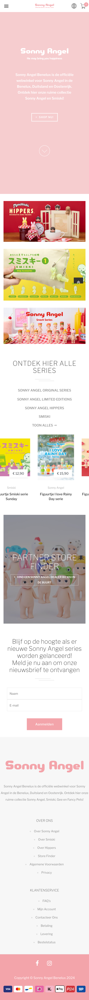
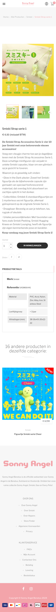
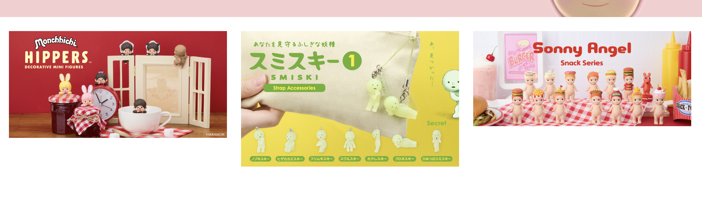
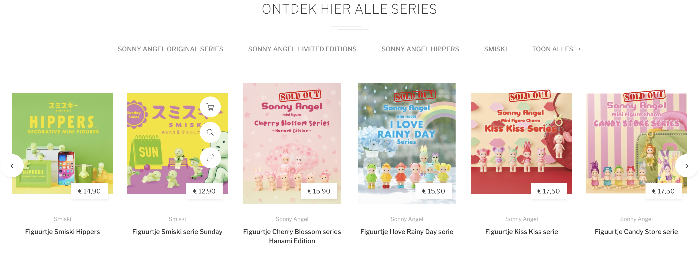

# Procesverslag
Markdown is een simpele manier om HTML te schrijven.  
Markdown cheat cheet: [Hulp bij het schrijven van Markdown](https://github.com/adam-p/markdown-here/wiki/Markdown-Cheatsheet).

Nb. De standaardstructuur en de spartaanse opmaak van de README.md zijn helemaal prima. Het gaat om de inhoud van je procesverslag. Besteedt de tijd voor pracht en praal aan je website.

Nb. Door *open* toe te voegen aan een *details* element kun je deze standaard open zetten. Fijn om dat steeds voor de relevante stuk(ken) te doen.

## Fatima Khatib

  
uitwerken voor kick-off werkgroep

  ### Auteur:
 Fatima Khatib

  #### Je startniveau:
Blauw

  #### Je focus:
Responsive
 

## [Je website](https://www.sonnyangel-benelux.com/nl/)

  
uitwerken voor kick-off werkgroep

  ### Je opdracht:
  [Sonny Angel](https://www.sonnyangel-benelux.com/nl/)

  #### Screenshot(s) van de eerste pagina (small screen): 
  Home page 
  

  #### Screenshot(s) van de tweede pagina (small screen):
  Detail pagina Smiski Strap serie 1 
  
 

## Toegankelijkheidstest 1/2 (week 1)

  
uitwerken na test in 2e werkgroep

  ### Bevindingen
Accessibility findings – Sonny Angel website

tijdens het testen van de Sonny Angel website met de voiceover functie, zijn er mij meerdere dingen opgevalen:

Images:

Bijna alle images hebben geen proper alt attributes.

Screen readers lezen heel veel vakjes als “image” zonder description, wat het onmogelijk maakt voor een gebruiker zonder visuele ondersteuning.

Er zijn dus ook lege alt-attributen aanwezig, waardoor belangrijke visuele informatie niet wordt overgebracht.

Structure & Headings

The HTML structure is niet best voor accessibility.

Headings hebben blijkbaar geen duidelijke hierarchy.

Wanneer je met een screen reader navigeert, the focus springt van de ene naar de andere plek, in plaats van een logische reading order.

Navigation

de navigation links aanwezig en functuneren zoals het hoort, maar door het gebrek aan beschrijvende labels en een duidelijke heading-structuur is het moeilijker om de context van elke pagina te begrijpen.

VoiceOver zegt in de meeste plekken “link, link, link,” zonder context.

Color & Contrast

De site maakt veel gebruik van lichtroze op wit en lichtgrijs op wit.

Deze combinaties voldoen niet aan de richtlijnen voor contrastverhoudingen, vooral bij lopende tekst en sommige details op productpagina’s. Dit kan verwarrend of zelfs onleesbaar zijn voor gebruikers met een verminderd gezichtsvermogen of een kleurenzienstoornis.

Lists & Links

De site maakt wel gebruik van lists voor meerdere items, wat goed werkt. De links zijn over het algemeen duidelijk, maar zonder de juiste context (headings, context of alt-teksten) zijn ze minder bruikbaar voor screenreaders.

Overall impression

De site lijkt heel well-designed en clean.

Maar de toegankelijkheid kan heel veel verbeteringen hebben:

Duidelijker alt text voor images.

Betere heading structure voor een logical reading order.

Hoger contrast, volgens WCAG AA standards.

Betere descriptions voor links en interactieve elementen.

## Breakdownschets (week 1)

  
uitwerken na afloop 3e werkgroep

  ### de hele pagina: 
  

  ### dynamisch deel (bijv menu): 
  

  ### wellicht nog een dynamisch deel (bijv filter): 
  

## Voortgang 1 (week 2)

  
uitwerken voor 1e voortgang

  ### Stand van zaken
  hier dit ging goed & dit was lastig (neem ook screenshots op van delen van je website en code)

  ### Agenda voor meeting
  samen met je groepje opstellen

  | student 1      | student 2          | student 3    | student 4        |
  | ---            | ---                | ---          | ---              |
  | dit bespreken  | en dit             | en ik dit    | en dan ik dat    |
  | en dat ook nog | dit als er tijd is | nog een punt | dit wil ik zeker |
  | ...            | ...                | ...          | ...              |

  ### Verslag van meeting
  hier na afloop snel de uitkomsten van de meeting vastleggen

  - punt 1
  - punt 2
  - nog een punt
  - ...

## Voortgang 2 (week 3)

  
uitwerken voor 2e voortgang

  ### Stand van zaken
  hier dit ging goed & dit was lastig (neem ook screenshots op van delen van je website en code)

  ### Agenda voor meeting
  samen met je groepje opstellen

  | student 1      | student 2          | student 3    | student 4        |
  | ---            | ---                | ---          | ---              |
  | dit bespreken  | en dit             | en ik dit    | en dan ik dat    |
  | en dat ook nog | dit als er tijd is | nog een punt | dit wil ik zeker |
  | ...            | ...                | ...          | ...              |

  ### Verslag van meeting
  hier na afloop snel de uitkomsten van de meeting vastleggen

  - punt 1
  - punt 2
  - nog een punt
- ...

## Toegankelijkheidstest 2/2 (week 4)

  
uitwerken na test in 9e werkgroep

  ### Bevindingen
  Lijst met je bevindingen die in de test naar voren kwamen (geef ook aan wat er verbeterd is):

## Voortgang 3 (week 4)

  
uitwerken voor 3e voortgang

  ### Stand van zaken
  hier dit ging goed & dit was lastig (neem ook screenshots op van delen van je website en code)

  ### Agenda voor meeting
  samen met je groepje opstellen

  | student 1      | student 2          | student 3    | student 4        |
  | ---            | ---                | ---          | ---              |
  | dit bespreken  | en dit             | en ik dit    | en dan ik dat    |
  | en dat ook nog | dit als er tijd is | nog een punt | dit wil ik zeker |
  | ...            | ...                | ...          | ...              |

  ### Verslag van meeting
  hier na afloop snel de uitkomsten van de meeting vastleggen

  - punt 1
  - punt 2
  - nog een punt
  - ...

## Eindgesprek (week 5)

  
uitwerken voor eindgesprek

  ### Je uitkomst - karakteristiek screenshots:
  

  ### Dit ging goed/Heb ik geleerd: 
  Korte omschrijving met plaatjes

  

  ### Dit was lastig/Is niet gelukt:
  Korte omschrijving met plaatjes

  

## Bronnenlijst

  
continu bijhouden terwijl je werkt

  Nb. Wees specifiek ('css-tricks' als bron is bijv. niet specifiek genoeg). 
  Nb. ChatGpT en andere AI horen er ook bij.
  Nb. Vermeld de bronnen ook in je code.

  1. bron 1
  2. bron 2
  3. ...

